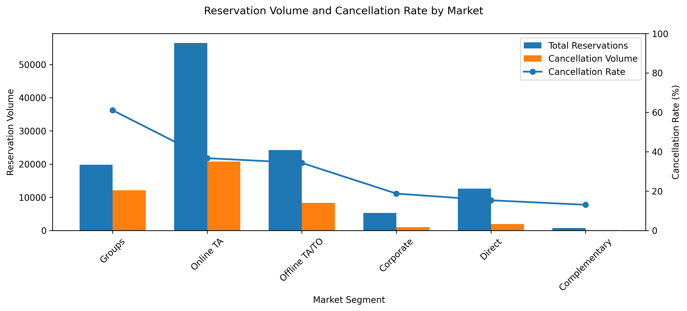
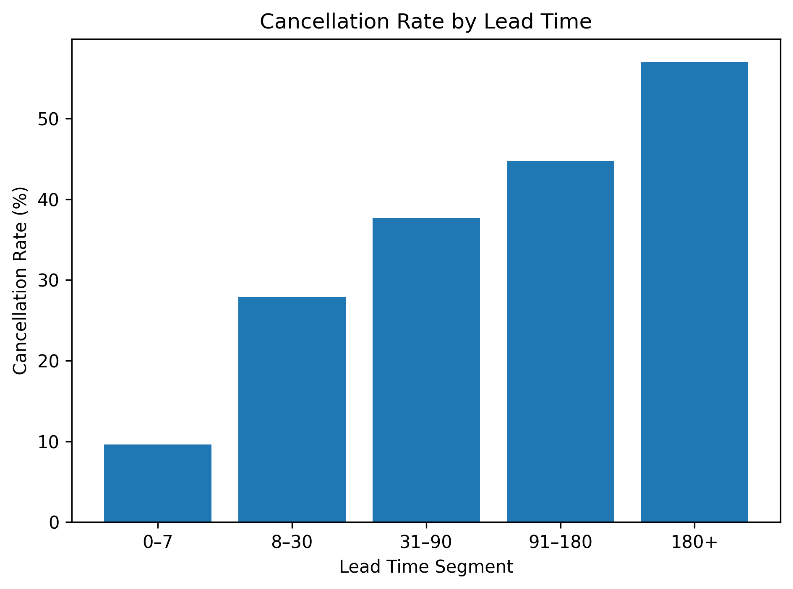

# Hotel Booking Cancellation Analysis

## Project Overview

This project analyzes hotel booking data to identify the main patterns associated with booking cancellations. The analysis focuses on market segments, lead time, and deposit type to determine which bookings carry the highest cancellation risk.

## Business Problem

Hotel cancellations reduce occupancy predictability and may result in potential lost booking value. Management needs to understand which booking characteristics are associated with higher cancellation rates and where operational intervention should be prioritized.

## Objectives

- Measure the overall cancellation rate.
- Identify market segments with the highest cancellation risk.
- Investigate the relationship between lead time and cancellation.
- Compare lead-time distributions between canceled and non-canceled bookings.
- Validate the observed difference using statistical testing.
- Provide actionable business recommendations.

## Dataset

The dataset contains hotel reservations from City Hotel and Resort Hotel, including:

- Booking status
- Lead time
- Market segment
- Distribution channel
- Deposit type
- Average daily rate
- Length of stay
- Guest characteristics

The dataset is not included in this repository. Download it and place it inside the `data` folder using the following name:

`hotel_bookings.csv`

## Tools

- Python
- Pandas
- NumPy
- Matplotlib
- SciPy
- Jupyter Notebook

## Analysis Process

1. Data understanding and quality assessment
2. Missing-value analysis
3. Feature engineering
4. KPI calculation
5. Market-segment analysis
6. Lead-time investigation
7. Deposit-type analysis
8. Statistical validation
9. Business interpretation and recommendations

## Key Findings

- The overall cancellation rate was approximately 37%.
- Group bookings recorded the highest cancellation rate at approximately 61%.
- Canceled bookings had a higher median lead time than non-canceled bookings.
- Cancellation rate increased consistently as lead time increased.
- Non-refundable bookings showed an unusually high cancellation rate and require further investigation.

## Visualizations

### Cancellation Rate by Market Segment



### Lead Time Distribution by Cancellation Status


### Cancellation Rate by Lead Time Segment



## Statistical Validation

A Mann–Whitney U test was used to compare lead time between canceled and non-canceled bookings because lead time was not normally distributed.

The test indicated a statistically significant difference between the two groups. Effect size was also calculated to assess the practical magnitude of the difference.

## Business Recommendations

- Prioritize bookings made more than 90 days in advance for reconfirmation.
- Send automated reminders before the arrival date.
- Review cancellation policies for Group and Online Travel Agent bookings.
- Investigate the interaction between market segment and deposit type.
- Consider developing a cancellation-risk scoring model.

## Limitations

- The findings represent associations and do not establish causation.
- Estimated booking value does not account for cancellation fees, refunds, or replacement bookings.
- External factors that may affect cancellation were not available in the dataset.

## Repository Structure

```text
hotel-booking-cancellation-analysis/
├── data/
│   └── README.md
├── images/
│   ├── cancellation_by_market.png
│   ├── lead_time_distribution.png
│   └── cancellation_by_lead_time.png
├── hotel_booking_cancellation_analysis.ipynb
├── README.md
├── requirements.txt
├── .gitignore
└── LICENSE
